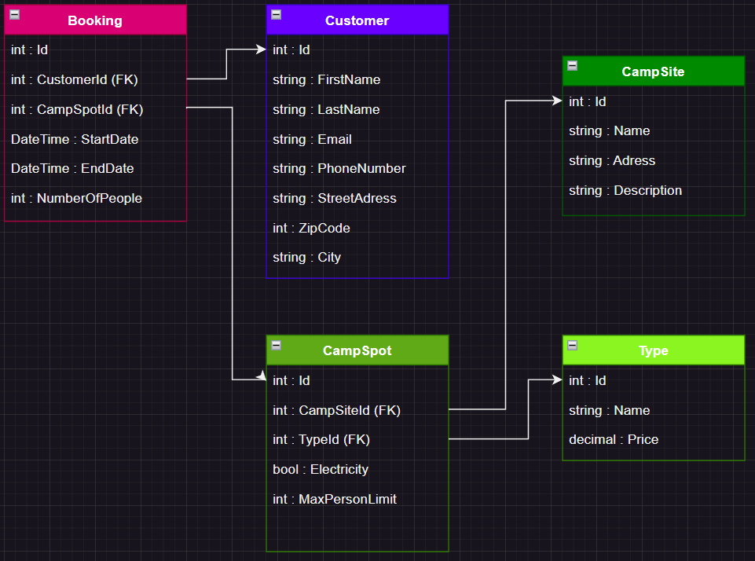

# 🏕️ IslandHorses Booking System – Camping Edition

A RESTful API built with C# and ASP.NET Core for managing campsite bookings. This system supports bookings for tents, Caravans and cabins, including add-ons like parking and WiFi.

---

## 📚 Table of Contents

- [📌 About the Project](#-about-the-project)
- [🧱 Architecture Overview](#-architecture-overview)
- [🧩 Data Models](#-data-models)
- [🌐 API Endpoints](#-api-endpoints)
- [✅ Testing Strategy](#-testing-strategy)
- [⚙️ Technologies Used](#️-technologies-used)
- [🚀 Installation](#-installation)
- [💻 Running Locally](#-running-locally)
- [🙌 Contributors](#-contributors)
- [📄 License](#-license)

---

## 📌 About the Project

IslandHorses Booking System is a modern and extendable backend API for managing campsite operations. Built using SOLID principles and the Repository pattern, the system handles:

- Guest bookings
- Receptionist check-ins and modifications
- Campsite owner overview and administration
- Price calculation including nights and optional services
- Conflict detection (prevent overlapping bookings)

---

## 🧱 Architecture Overview

```
Controllers
    ↓
Services (business logic, validation)
    ↓
Repositories (data access abstraction)
    ↓
EF Core / DbContext (SQL Server or SQLite)
```

- 🧾 DTOs for input/output separation
- 🧪 Parts developed with TDD-first approach with MSTest & Moq
- 🔐 Optional: JWT authentication & role-based access

---

## 🧩 Data Models

### 🧍 Customer
```csharp
Id, FirstName, LastName, Email, PhoneNumber, StreetAddress, ZipCode, City
```

### 🏕️ CampSpot
```csharp
Id, CampSiteId, SpotTypeId, Electricity
```

### 🔖 SpotType
```csharp
Id, Name, Price, MaxPersonLimit
```

### 📍 CampSite
```csharp
Id, Name, Description, Address
```

### 📅 Booking
```csharp
Id, CustomerId, CampSpotId, StartDate, EndDate, NumberOfPeople,
Parking (bool), Wifi (bool), Status (enum: Pending, Confirmed, Completed, Cancelled)
```

---

## 🌐 API Endpoints

### 👤 Guest
| Method | Endpoint | Description |
|--------|----------|-------------|
| `POST` | `/api/booking/CreateBooking` | Create a booking as guest |
| `PATCH` | `/api/booking/Addons/{id}` | Update WiFi and parking add-ons |
| `PATCH` | `/api/booking/GuestCancelBooking/{id}` | Cancel your booking |
| `GET` | `/api/CampSpot/searchAvailableSpotsMatchingDates | Search for available camps spots matching inputed dates |

### 🧑‍💼 Receptionist
| Method | Endpoint | Description |
|--------|----------|-------------|
| `POST` | `/api/booking/CreateBookingWithCustomer` | Create booking and new customer |
| `PUT` | `/api/booking/UpdateBooking/{id}` | Update existing booking |
| `GET` | `/api/booking/{id}` | Get booking by ID |
| `GET` | `/api/booking/customer/{customerId}` | Get bookings by customer |
| `GET` | `/api/CampSpot/SearchAvailableSpot | Search for available spots based on dates, type, spot, electricity and number of guests |

### 🧑‍🌾 Camp Owner
| Method | Endpoint | Description |
|--------|----------|-------------|
| `GET` | `/api/booking/campsite/{campSiteId}` | Get all bookings for a specific campsite |
| `DELETE` | `/api/booking/{id}` | Delete a booking |

### CRUD operations
In addition to above there are CRUD operations for Customer, CampSpot, CampSite, SpotType, Booking models/tables.

---

## ✅ Testing Strategy

| Type | Tool | Coverage |
|------|------|----------|
| Unit Tests | `MSTest` | Services (BookingService, validation, calculations) |
| Mocking | `Moq` | For external dependencies |
| Integration Tests | `Postman / Swagger` | Endpoint-level testing |

In addtionm, EF Core and `SQLite In-Memory`has been used for in-memory database creation for testing repositories.

> All critical flows are tested: model data creation, modification, cancellation, and availability validation for camp spots.

---

## ⚙️ Technologies Used

- ASP.NET Core 7
- C# 11
- Entity Framework Core
- SQLite / SQL Server
- MSTest + Moq
- Swagger / OpenAPI
- AutoMapper (optional)

---

## 🚀 Installation

```bash
git clone https://github.com/YourUsername/IslandHorses-BookingSystem-Camping.git
cd IslandHorses-BookingSystem-Camping
dotnet restore
```
---



## 🙌 Contributors

- [GitHub - Jenny-Ann Hayward](https://github.com/tantting)
- [GitHub - Leon Johansson](https://github.com/Conixen)
- [GitHub - Johan Svensson](https://github.com/Darkdusk234)
- [GitHub – Fredrik Jonsson](https://github.com/JonssonF)

---

## 📄 License

MIT License – free to use, modify and distribute.


